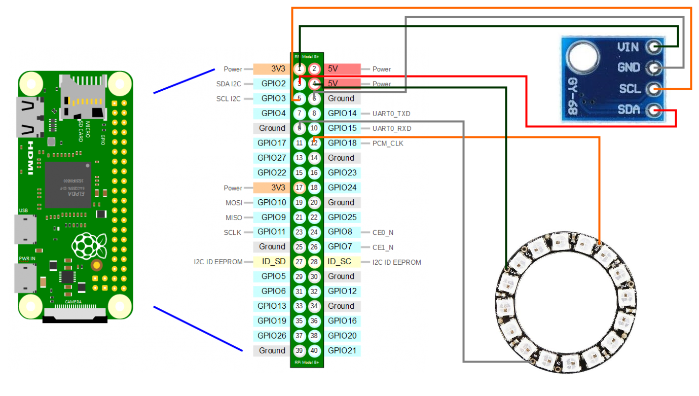

# BubLight
Light up your hookah with a neopixel ring!

Get some **RaspberryPi**, connect the **neopixel LED ring** and the **BMP180 pressure sensor** to it,
upload and start **BubLight** `.jar` file and you are ready to go!
You can then connect to a **BubLight** web thingy, where you can **configure colors** and
modes and see some **nice graph** showing **realtime pressure**!

## NOTE
This **hobby project** is still **WORK IN PROGRESS** and it does not have any release yet.
However, it had some successful demos :).

## Build and start in simulated mode
Hardware parts (the LED ring and the pressure sensor) are simulated in the simulated mode.

Steps:
1. Build project with maven command from the root of the project:
`mvn clean install -P build-web`. Profile `build-web` will build both backend and frontend
and include it in final `.jar` file.
2. Go to the target directory: `cd lighty-backend/target`
3. Start `.jar` file in a simulated mode: `java -jar bublight-backend-0.0.2-SNAPSHOT.jar --bublight.simulatedMode=true`
4. Open `localhost:8080` in your browser
5. You can try to set simulated pressure value with REST POST request:
`curl -X POST http://localhost:8080/pressure/simulated/<INTEGER_PRESSURE_VALUE>`
6. Play with it!

## Connection schema
Components used in demo:
- Raspberry Zero W 1.1
- GY-68 (BMP180)
- Adafruit Neopixel Ring (16x LED)

## Screenshot
To give an idea how does it look - but it may and will change since it's still under development.

